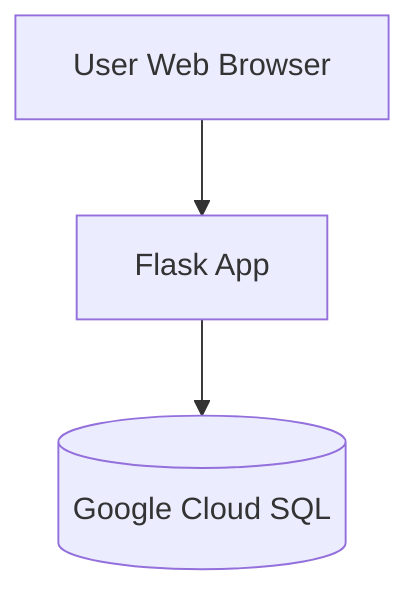

# Architecture Plan

## High-Level Architecture
The application is implemented as a web-based system using a Flask application and Google Cloud SQL as our relational database. The architecture is made to support low-volume usage and ease of deployment. 

## Data Flow Narrative 
- User enters data in the Flask web form
This is when a user (like a research assistant) types information into the webpage, for example, a participant ID, whether they are enrolled, or whether medication was taken.

- Flask would upload CSVs to Cloud Storage
In a real cloud setup, instead of storing files locally, Flask could upload CSV files to Google Cloud Storage. This would allow data to be stored centrally and accessed securely from anywhere.

- Dashboard displays totals from the database
The dashboard page pulls information from the database to show simple summaries, such as how many participants are enrolled or how many participants are adhering to medication. 

- Data export and CSV storage in Google Cloud storage (GCS)
The CSV files can be exported and used to present KPIs to research team during meetings. The files will also be stored in Google Cloud storage for sharing and end of study analysis. GCS is a general- purpose storage service that provides a low-cost option for companies of all sizes. 

## Security & Governance

- In order to protect PHI and minimize the risk of a breach of confidentiality: 
    - User roles can be assigned to those who are allowed to access databases and storage (research team)
    - Can create user accounts instead of personal user credentials.
    - Environment variable secrets: Sensitive information (like database passwords) would not be hardcoded into the app.

## Cost Considerations 

- Cloud costs:
    - Cloud SQL would be the most expensive because it is a managed database.
    - Cloud Run is relatively cheap because it only runs when requests come in.
    - Cloud Storage costs very little for small files like CSVs.

|Layer| Service (Cloud) | Role in Solution| Related Assignment/Module |
|-------|-----------------|-----------------|-------------------------|
|Storage|GCP Cloud Storage|Store raw uploaded CSV files |Module 6| 
|Compute|Cloud Run|Run containerized Flask API|Module 3|
|Database/SQL|Cloud SQL|Store cleaned/aggregated tables for reporting|Module 7|
